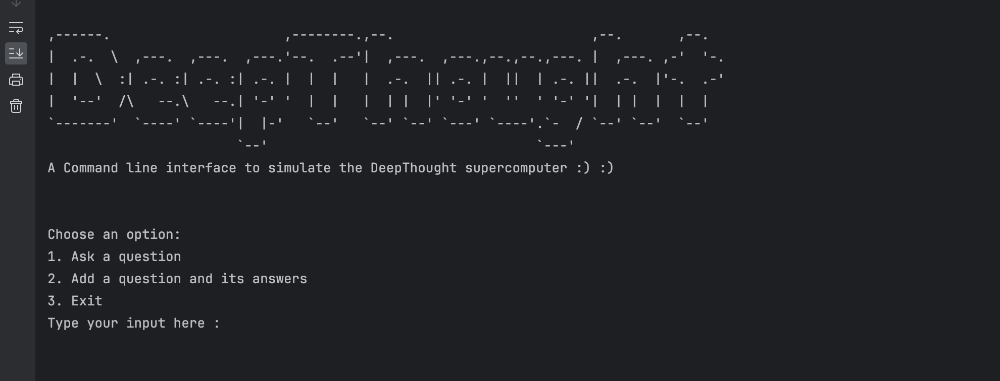

# cgm-code-challenge - A Java Command Line Tool 

A Java command line program that support two options. One to ask a specific question and the other option is to add questions and their answers.

## Tech Stack

 Java 21
 
 - This is how main entry point looks like
 
 
 
 - And some insights about unit testing coverage
 
 
